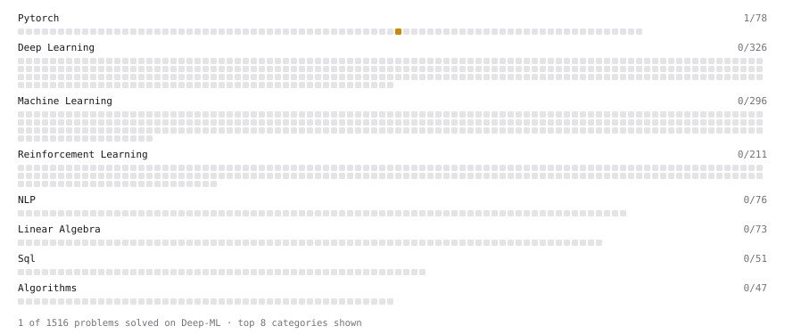

# Deep-ML

My machine learning practice from [Deep-ML](https://www.deep-ml.com). Every solution here was written by hand.

**2** solved · 1 problems · 0 labs · 1 math

[**Browse the interactive portfolio**](https://parthgupta2820-art.github.io/deep-ml/) to replay this filling in over time.

## Problems

| | Difficulty | Solved | |
| --- | --- | --- | --- |
| [SGD with Momentum Step](https://www.deep-ml.com/problems/1235) | medium | 2026-10-02 | [solution](problems/1235-sgd-with-momentum-step) |

## Math

| | Difficulty | Solved | |
| --- | --- | --- | --- |
| [Vector Operations](https://www.deep-ml.com/math-problems/7) | easy | 2026-10-01 | [solution](math/0007-vector-operations) |

---

_This file is regenerated by Deep-ML on every push._
